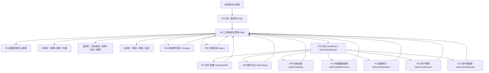

更新日期：2026-06-15

适用范围：中亚胡杨林生态系统保护数据共享平台前端界面重设计

当前状态：规划中

代码边界：本轮日志只约束前端与接口文档协作，不修改后端代码。

## 1. 日志目标

本文档用于在正式大规模调整前，先把前端界面数量、页面关系、功能边界、API 依赖和开发顺序梳理清楚，作为后续逐项开发、验收和与后端工程师协作的进度对照表。

本日志依据以下既有资料整理：

1.  [design-docs.md](./design-docs.md)：平台总体功能与架构边界。

2.  [frontend-ui-redesign-proposal.md](./frontend-ui-redesign-proposal.md)：前端视觉与工作台深化方案。

3.  [developer-guide.md](./developer-guide.md)：现有接口使用方式与权限说明。

4.  [openapi.yaml](./openapi.yaml)：当前权威 API 契约。

5.  当前前端路由：frontend/src/App.tsx、frontend/src/router.tsx。

6.  视觉参考：国家遥感数据与应用服务平台 https://www.cpeos.org.cn/dataSearch3D/#/standardProduct。

视觉参考只借鉴其信息组织、组件形态和空间布局关系，不复用对方品牌、图标、素材、源代码或专有数据。

## 2. 核心结论

本轮前端重设计建议按“12 个可路由页面 + 1 个主界面大型弹层”组织开发，因此实际需要纳入验收的前端界面共 13 个。

如果只按浏览器 URL 页面统计，则是 12 个页面；如果按用户实际看到和操作的独立界面统计，则应把 /map 内的“数据资源中心弹层”单独纳入，共 13 个界面。

| **类型** | **数量** | **说明** |
|----|----|----|
| 可路由页面 | 12 | 登录、地理可视化、非地理可视化、专题目录、8 个后台页面 |
| 主界面大型弹层 | 1 | 数据资源中心，属于 `/map` 内的高复杂度业务界面 |
| 重定向路由 | 3 | `/`、`/admin`、`/admin/auth` 只负责跳转，不算独立界面 |
| 主界面常驻工作区 | 5 | 顶部导航、中央地图、左侧栏、右侧栏、底部栏，作为 `/map` 的组成模块开发 |

目标界面清单如下：

| **编号** | **界面** | **路由或入口** | **统计口径** |
|----|----|----|----|
| F01 | 统一登录页 | `/login` | 可路由页面 |
| F02 | 三维地球主界面 / 地理可视化 | `/map` | 可路由页面 |
| F03 | 数据资源中心 | `/map` 内弹层 | 主界面大型弹层 |
| F04 | 非地理可视化 | `/nongeo` | 可路由页面 |
| F05 | 专题目录 | 建议新增 `/topics` | 可路由页面 |
| F06 | 后台 Dashboard | `/admin/dashboard` | 可路由页面 |
| F07 | 用户设置 / 个人中心 | `/admin/profile` | 可路由页面 |
| F08 | 操作日志 | `/admin/logs` | 可路由页面 |
| F09 | 系统设置 | `/admin/settings` | 可路由页面 |
| F10 | 存量数据管理 | `/admin/data/inventory` | 可路由页面 |
| F11 | 数据导入 | `/admin/data/import` | 可路由页面 |
| F12 | 用户管理 | `/admin/auth/users` | 可路由页面 |
| F13 | 用户组权限 | `/admin/auth/groups` | 可路由页面 |

## 3. 页面连接关系

连接规则：

1. 未登录用户访问任何受保护页面时进入 /login。

2. 登录成功后默认进入 /map，/ 继续重定向到 /map。

3. /map 是主工作台，非地理可视化、专题目录、管理后台都从顶部导航进入。

4. 管理后台入口只对具备 core.access_admin 权限的用户显示。

5. 后台各页面应提供“返回三维地球”入口，避免用户迷失在后台层级中。

6. 数据资源中心不离开地图上下文，以弹层或宽抽屉形式出现在 /map 上方。

## 4. 主界面视觉参考拆解

参考国家遥感数据与应用服务平台的主界面时，本项目只吸收可泛化的 UI 结构：

| **参考界面特征** | **本项目转化方式** |
|----|----|
| 顶部黑色导航 + 搜索胶囊 | 转化为平台品牌区、模块导航、全局检索、用户区 |
| 左侧竖向产品分类栏 | 转化为地理工作台左侧 `数据 / 图层 / 专题` 分组入口 |
| 左侧条件检索面板 | 转化为数据 Tab 与数据资源中心的筛选区 |
| 条件检索 / 查询结果切换 | 转化为资源检索结果、空间查询结果、图层加载状态切换 |
| 中央三维地球主视图 | 保留本平台地图核心，强化胡杨林重点区域、河流廊道、样地和栅格影像表达 |
| 右侧竖向工具按钮 | 转化为地图控件组：复位、定位、底图、全屏、测量、绘制等 |
| 底部经纬度与视角状态栏 | 转化为坐标、比例尺、视角高度、当前范围状态显示 |
| 深色沉浸背景 + 浮动面板 | 保留原左右侧边栏和下边栏结构，提升半透明面板层次和可读性 |

需要避免的做法：

1. 不复制对方 Logo、产品名、图标、图片素材和源代码。

2. 不照搬其遥感产品分类名称，应使用本项目的胡杨林生态数据分类。

3. 不把栅格符号化搬到前端；前端只展示后端返回的瓦片和渲染结果。

## 5. 界面功能与 API 对照

| **编号** | **界面** | **当前前端位置** | **核心功能** | **主要 API 依赖** | **权限与访问** | **重设计重点** | **状态** |
|----|----|----|----|----|----|----|----|
| F01 | 统一登录页 | `frontend/src/pages/LoginPage.tsx` | 登录、注册入口、记住登录、错误提示、系统第一印象 | `/api/bootstrap/`、`/api/auth/csrf/`、`/api/auth/login/`、`/api/auth/register/`、`/api/auth/me/` | 未登录可访问；已登录重定向 `/map` | 沉浸式生态背景、右侧登录表单、轻量数据指标 | 未开始 |
| F02 | 三维地球主界面 | `frontend/src/pages/MapPage.tsx` | 地图浏览、图层管理、数据检索、空间查询、结果分析、顶部导航 | `/api/catalog/resources/`、`/api/catalog/directories/`、`/api/layers/`、`/api/raster/render/`、`/api/search/`、导出和任务接口 | 登录后访问；功能按钮按权限显示 | 参考遥感平台布局，保留左右下栏，升级工作台视觉 | 未开始 |
| F03 | 数据资源中心 | 现有 `DataPanel` 能力演进 | 资源筛选、资源预览、字段元数据、加载到地图、最近使用 | `/api/catalog/resources/`、`/api/catalog/resources/{id}/profile/`、`/api/raster/datasets/` | 需 `core.browse_data`，加载按矢量/栅格权限控制 | 宽弹层三列结构：筛选、列表、详情 | 未开始 |
| F04 | 非地理可视化 | `frontend/src/pages/NonGeoPage.tsx` | 表格、基因、文档、图片等非空间数据分析 | 现有资源列表与搜索接口可支撑总览；高级分析可能需要新增接口 | 登录后访问，按数据可见范围裁剪 | 从空承载页升级为科研数据分析工作台 | 未开始 |
| F05 | 专题目录 | 建议新增页面 | 专题列表、专题筛选、专题详情、关联图层或资源 | `/api/topics/`、`/api/search/`；详情和附件预览能力待确认 | 登录后访问，需浏览数据权限 | 顶部导航独立入口，承接设计文档“专题展示”要求 | 未开始 |
| F06 | 后台 Dashboard | `frontend/src/admin/AdminDashboardPage.tsx` | 资源、图层、栅格、用户、活跃用户、服务器状态 | `/api/admin/dashboard/`、`/api/admin/dashboard/server/` | 需 `core.access_admin`；卡片按 Dashboard 权限返回 | Ant Design Pro 风格增强指标图表 | 未开始 |
| F07 | 用户设置 / 个人中心 | `frontend/src/admin/AdminProfilePage.tsx` | 个人资料、头像、密码、主动关闭权限 | `/api/admin/profile/`、`/api/admin/profile/update/`、`/api/admin/profile/password/`、`/api/admin/profile/permissions/` | 后台用户可访问 | 信息结构优化、权限可视化、安全状态 | 未开始 |
| F08 | 操作日志 | `frontend/src/admin/AdminOperationLogsPage.tsx` | 审计日志筛选、分页、导出、风险定位 | `/api/admin/operation-logs/` | 需 `core.view_operation_logs`，范围按日志权限裁剪 | 表格效率优先，增加趋势和异常摘要 | 未开始 |
| F09 | 系统设置 | `frontend/src/admin/AdminSystemSettingsPage.tsx` | 系统名称、注册开关、栅格配置、运行配置查看 | `/api/admin/settings/` | 需 `core.manage_system_settings` | 配置健康、缓存/脚本状态展示 | 未开始 |
| F10 | 存量数据管理 | `frontend/src/admin/AdminDataInventoryPage.tsx` | 数据清单、启停、访问范围、默认可视化、删除确认、清单导出 | `/api/admin/data/resources/`、`/api/admin/data/resources/{id}/`、`/api/admin/data/resources/export/` | 查看需 `catalog.view_dataresource`，编辑需 `catalog.change_dataresource`，删除需 `catalog.delete_dataresource`，导出需 `catalog.export_dataresource` | 高密度表格 + 统计卡 + 右侧抽屉 | 未开始 |
| F11 | 数据导入 | `frontend/src/admin/AdminDataImportPage.tsx` | 文件选择、预检、校验、字段元数据、提交入库 | `/api/catalog/import/preview/`、`/api/catalog/import/validate/`、`/api/catalog/import/commit/` | 需 `catalog.add_dataresource` | 步骤化导入、校验结果可视化、错误定位 | 未开始 |
| F12 | 用户管理 | `frontend/src/admin/AdminAuthPage.tsx` | 用户列表、新建、启停、删除、重置密码、分组、直授权限 | `/api/users/`、`/api/users/{userId}/...`、`/api/groups/` | 需 `core.manage_auth`；新建需 `core.create_user` | 用户状态、角色分布、权限影响提示 | 未开始 |
| F13 | 用户组权限 | `frontend/src/admin/AdminAuthPage.tsx` | 用户组列表、创建、修改、权限矩阵、保护组提示 | `/api/groups/`、`/api/groups/{groupId}/` | 需 `core.manage_auth` 和部分功能权限配置权限 | 权限矩阵、模块覆盖率、风险权限提示 | 未开始 |

## 6. /map 主工作台模块拆分

/map 是本轮前端优化的第一优先级。虽然它只算一个路由页面，但内部需要按工作区拆成可并行开发的组件任务。

| **工作区** | **推荐组件方向** | **功能边界** | **API 影响** |
|----|----|----|----|
| 顶部全局导航 | `GlobalNav` 或 `WorkspaceHeader` | 品牌、模块切换、全局搜索、用户信息、后台入口 | 全局搜索使用现有 `/api/search/`；若需要搜索建议再提 API |
| 中央地图视图 | `MapCanvas` 强化 | 三维地球、图层渲染、地图控件、坐标状态 | 复用现有图层、栅格、瓦片接口 |
| 左侧栏 | `WorkspaceLeftPanel` | `数据 / 图层 / 专题` Tabs，资源入口和图层控制 | 数据与图层复用现有接口；专题组合若需后端持久化再提 API |
| 右侧栏 | `WorkspaceRightPanel` | 当前视角缩略图、生态概览、要素详情、监测状态 | 要素详情复用当前选中要素；生态/监测指标多数待 API 确认 |
| 底部栏 | `WorkspaceBottomPanel` 扩展 | 空间查询、结果表、时间轴、图例 | 查询和导出复用现有接口；时间序列分析可能待 API |
| 数据资源中心 | `DataResourceCenterDrawer` | 资源筛选、列表/表格/卡片切换、详情、加载 | 复用资源列表、profile、raster dataset 接口 |
| 图层数据表弹窗 | `LayerDataTableModal` 强化 | 图层属性表、行地图联动、字段筛选、导出入口 | 复用已加载图层数据与导出接口 |
| 符号化编辑器 | `SymbolizationEditor` 强化 | 矢量样式、栅格规则 JSON、默认/自定义规则 | 栅格规则仍由后端渲染，前端只提交规则 |

主界面交互闭环：

1. 用户从顶部导航确认当前模块。

2. 用户在左侧 数据 Tab 或数据资源中心检索资源。

3. 用户加载资源后生成图层组，进入左侧 图层 Tab。

4. 用户在地图中浏览、点击要素或绘制范围。

5. 绘制范围进入底部 空间查询，查询结果进入底部 结果。

6. 选中要素进入右侧 要素 Tab，图层元数据进入底部或弹窗详情。

7. 栅格和矢量图例统一进入底部 图例。

## 7. OpenAPI 协作原则

本次日志本身不修改 docs/openapi.yaml，因为当前没有正式确认新增或变更接口。

后续前端开发时，只要出现以下任一情况，必须同步更新 OpenAPI 文档：

1. 新增接口。

2. 删除接口。

3. 修改 URL、HTTP 方法、参数、请求体、响应体、状态码。

4. 修改认证、权限或错误返回行为。

5. 前端新增字段依赖，且该字段需要后端正式返回。

协作流程：

1. 先在本日志“API 协作台账”登记需求和所属界面。

2. 更新 [openapi.yaml](./openapi.yaml)，补齐 operationId、description、schema、错误响应和 security。

3. 更新 [developer-guide.md](./developer-guide.md)，说明使用场景和权限。

4. 运行前端 API 生成与校验命令：pnpm run generate:api、pnpm run check:api、pnpm run api:docs、pnpm run api:lint。

5. 前端通过 frontend/src/api/client.ts 接入，不手写重复 DTO。

6. 后端工程师按 OpenAPI 契约实现接口。

## 8. API 协作台账

以下条目是前端设计阶段发现的潜在接口需求，不代表已经变更 OpenAPI。只有进入“已确认”状态后，才更新 docs/openapi.yaml 和 docs/developer-guide.md。

| **编号** | **潜在需求** | **涉及界面** | **当前接口是否已覆盖** | **建议处理** | **状态** |
|----|----|----|----|----|----|
| API-01 | 主界面生态态势指标：生态健康指数、NDVI 趋势、水分指数、风险面积、站点在线率 | F02、右侧栏 | 当前无专用普通用户概览接口；后台 Dashboard 仅覆盖管理统计 | 第一阶段可使用静态占位或从已有资源数据推导；确认真实指标后新增概览接口 | 待确认 |
| API-02 | 专题场景与推荐图层组合：胡杨分布、水文生态、遥感影像、野外监测 | F02、左侧专题 Tab | 当前可通过资源分类推导，但没有“专题场景”实体接口 | 若需要后台维护专题组合，新增专题场景列表/详情接口 | 待确认 |
| API-03 | 数据资源中心顶部统计：资源总量、可渲染、可查询、权限受限、今日更新 | F03 | 资源列表可部分推导，权限受限和今日更新可能不完整 | 先前端从分页结果和筛选条件推导；需要全量准确统计时新增资源统计接口 | 待确认 |
| API-04 | 非地理数据分析：表格字段分布、分组统计、相关性、基因热力图数据 | F04 | 现有资源接口能列出数据，但不提供通用非地理分析查询 | 非地理页第一阶段做资源总览；高级分析需独立接口设计 | 待确认 |
| API-05 | 专题详情、附件预览、专题关联图层加载 | F05 | 现有 `/api/topics/` 为列表；详情深度能力待确认 | 第一阶段可用列表；需要详情页时新增详情接口或扩展列表字段 | 待确认 |
| API-06 | 全局搜索建议和分组搜索结果高亮 | F02、F05 | `/api/search/` 可搜索资源和专题，不提供建议 | 第一阶段使用普通搜索；建议能力后续再提 | 待确认 |
| API-07 | 监测站、样方、遥感任务队列与异常指标 | F02、右侧监测 Tab | 当前无监测专用接口 | 若后端暂无业务数据，先保留静态空状态和接口占位说明 | 待确认 |
| API-08 | 时间轴批次、多年份对比、事件带 | F02、底部时间 Tab | 当前资源有日期字段，缺少时间序列聚合接口 | 第一阶段按资源日期做轻量展示；高级对比再设计 API | 待确认 |

## 9. 开发阶段进度日志

### P0 页面梳理与协作基线

| **任务** | **内容** | **API 影响** | **验收标准** | **状态** |
|----|----|----|----|----|
| P0-01 | 建立前端界面清单、页面关系和开发日志 | 无 | 本文档完成并可作为任务看板使用 | 已完成 |
| P0-02 | 确认前端开发边界：只改前端代码和接口文档，不改后端实现 | 无 | 后续任务遵循前后端分离协作流程 | 已完成 |
| P0-03 | 明确主界面视觉参考转化规则 | 无 | 只借鉴布局和组件关系，不复用外部品牌和素材 | 已完成 |

### P1 前端设计系统与全局框架

| **任务** | **内容** | **API 影响** | **验收标准** | **状态** |
|----|----|----|----|----|
| P1-01 | 梳理颜色、字体、间距、面板、按钮、图表主题 token | 无 | 形成统一 CSS 变量或主题配置，避免单一色调 | 未开始 |
| P1-02 | 统一路由转场、加载态、空状态、错误态 | 无 | 登录、地图、后台页面状态一致 | 未开始 |
| P1-03 | 抽象顶部全局导航 | 可能使用 `/api/search/` | 地理、非地理、专题、后台入口统一 | 未开始 |
| P1-04 | 增加专题目录前端路由 `/topics` | 使用现有专题接口 | `/topics` 可从顶部导航进入 | 未开始 |

### P2 登录页重设计

| **任务** | **内容** | **API 影响** | **验收标准** | **状态** |
|----|----|----|----|----|
| P2-01 | 重构登录页布局为左视觉 + 右表单 | 无 | 桌面和常见小屏不溢出 | 未开始 |
| P2-02 | 保留登录、注册、记住登录、错误提示逻辑 | 无 | 现有认证测试通过 | 未开始 |
| P2-03 | 增加生态数据氛围元素和轻量指标 | API-01 可选 | 没有真实数据时使用明确空态或占位文案 | 未开始 |

### P3 三维地球主界面视觉框架

| **任务** | **内容** | **API 影响** | **验收标准** | **状态** |
|----|----|----|----|----|
| P3-01 | 重构 `/map` 顶部导航、左右侧栏、底部栏、中央地图层级 | 无 | 保留原左右下栏设计，并提升沉浸感 | 未开始 |
| P3-02 | 地图控件组改造：复位、定位、底图、全屏、测量、绘制 | 无 | 控件稳定、不遮挡地图内容 | 未开始 |
| P3-03 | 坐标、比例尺、视角高度状态栏 | 无 | 地图移动时状态及时更新 | 未开始 |
| P3-04 | 主界面响应式与面板折叠 | 无 | 左、右、下栏均可折叠，地图区域稳定 | 未开始 |

### P4 左侧栏与数据资源中心

| **任务** | **内容** | **API 影响** | **验收标准** | **状态** |
|----|----|----|----|----|
| P4-01 | 左侧栏改为 `数据 / 图层 / 专题` Tabs | API-02 可选 | 数据检索和图层管理边界清晰 | 未开始 |
| P4-02 | 数据 Tab：检索、筛选、资源摘要、加载按钮 | 复用资源接口 | 能从资源列表加载矢量/栅格 | 未开始 |
| P4-03 | 图层 Tab：图层树、显隐、透明度、顺序、定位、导出 | 复用图层和导出接口 | 图层操作目标不超过 500ms | 未开始 |
| P4-04 | 专题 Tab：专题卡片、一键加载、完整度 | API-02 可选 | 无真实专题时使用资源分类推导 | 未开始 |
| P4-05 | 数据资源中心宽弹层 | API-03 可选 | 筛选、列表、详情、加载闭环可用 | 未开始 |

### P5 底部空间查询与结果分析

| **任务** | **内容** | **API 影响** | **验收标准** | **状态** |
|----|----|----|----|----|
| P5-01 | 底部栏扩展为 `空间查询 / 结果 / 时间 / 图例` Tabs | API-08 可选 | 面板内容稳定，不遮挡地图主视觉 | 未开始 |
| P5-02 | 空间查询：绘制、清除、导入/导出 GeoJSON、范围指标 | 无 | 绘制结果可用于查询和导出裁切 | 未开始 |
| P5-03 | 结果：表格、统计、地图高亮、导出 | 复用查询和导出接口 | 查询结果和地图要素双向联动 | 未开始 |
| P5-04 | 时间：年份/批次切换和事件带 | API-08 可选 | 第一阶段可按资源日期轻量展示 | 未开始 |
| P5-05 | 图例：当前可见图层图例与栅格色带 | 无 | 矢量和栅格图例统一可读 | 未开始 |

### P6 右侧态势洞察与要素详情

| **任务** | **内容** | **API 影响** | **验收标准** | **状态** |
|----|----|----|----|----|
| P6-01 | 右侧上栏：当前视角二维缩略与范围信息 | API 可选 | 展示中心点、范围、缩放层级或空态 | 未开始 |
| P6-02 | 概览 Tab：生态指标、趋势、风险和站点状态 | API-01、API-07 | 无真实数据时清晰说明待接入 | 未开始 |
| P6-03 | 要素 Tab：地图点击要素后的属性、趋势、关联资源 | 复用已加载要素 | 点击地图、表格行和图层节点能联动 | 未开始 |
| P6-04 | 监测 Tab：监测站、任务队列、异常指标 | API-07 | 第一阶段可做权限友好的空状态 | 未开始 |

### P7 非地理可视化

| **任务** | **内容** | **API 影响** | **验收标准** | **状态** |
|----|----|----|----|----|
| P7-01 | 非地理页布局：左数据集、中图表、右配置、底部数据表 | API-04 | 页面从空承载页变为可操作工作台 | 未开始 |
| P7-02 | 数据总览：类型、来源、年份、质量状态 | 复用资源接口或 API-04 | 无高级接口时仍能展示资源总览 | 未开始 |
| P7-03 | 表格、基因、专题、图片四类工作区 | API-04 | 高级分析功能按接口成熟度分阶段接入 | 未开始 |

### P8 专题目录

| **任务** | **内容** | **API 影响** | **验收标准** | **状态** |
|----|----|----|----|----|
| P8-01 | 新增专题目录页面和顶部导航入口 | 复用专题列表接口 | 能浏览专题列表并返回地图 | 未开始 |
| P8-02 | 专题筛选、搜索、列表/卡片视图 | 复用 `/api/topics/`、`/api/search/` | 专题和数据资源搜索结果分组清晰 | 未开始 |
| P8-03 | 专题详情、附件预览、关联图层 | API-05 可选 | 若后端无详情接口，先做列表级详情抽屉 | 未开始 |

### P9 管理后台视觉增强

| **任务** | **内容** | **API 影响** | **验收标准** | **状态** |
|----|----|----|----|----|
| P9-01 | Dashboard 增强 KPI、趋势、服务器仪表和操作时间线 | 复用后台 Dashboard 接口 | 未授权卡片不展示 | 未开始 |
| P9-02 | 用户设置增强权限可视化、安全状态 | 复用 profile 接口 | 个人信息和密码流程不回退 | 未开始 |
| P9-03 | 操作日志增强趋势、模块占比、异常摘要 | 可能需要前端聚合 | 表格筛选和分页仍是主体 | 未开始 |
| P9-04 | 系统设置增强配置健康与路径状态 | 可能需要 API 扩展 | 第一阶段不展示后端未提供的敏感路径细节 | 未开始 |
| P9-05 | 存量数据管理增强统计卡和右侧抽屉 | 复用存量数据接口 | 启停、权限、默认可视化流程可用 | 未开始 |
| P9-06 | 数据导入增强步骤、校验图表、错误排行 | 复用导入接口 | 错误信息能帮助用户修正数据 | 未开始 |
| P9-07 | 用户管理和用户组权限增强矩阵与风险提示 | 复用用户/用户组接口 | 保护组和权限限制提示清晰 | 未开始 |

### P10 质量、性能与文档收尾

| **任务** | **内容** | **API 影响** | **验收标准** | **状态** |
|----|----|----|----|----|
| P10-01 | 前端单元测试和关键路由 E2E 更新 | 无 | 登录、权限、导航、主流程覆盖 | 未开始 |
| P10-02 | 真实浏览器视觉检查 | 无 | 桌面和常见宽度无重叠、无溢出 | 未开始 |
| P10-03 | OpenAPI 变更最终核对 | 视前序任务而定 | `openapi.yaml`、`developer-guide.md`、生成类型同步 | 未开始 |
| P10-04 | 更新开发文档和测试说明 | 无 | 前端开发者能按文档接手维护 | 未开始 |

## 10. 验收检查清单

每个界面完成时至少检查：

1. 页面是否符合中文界面要求。

2. 是否没有修改后端代码。

3. 是否遵循当前权限门禁，未授权入口不展示或不可访问。

4. 是否使用 Ant Design 组件承载表单、表格、抽屉、弹窗、Tabs、筛选和反馈。

5. 是否没有把栅格符号化、分类、重采样或 PNG 生成搬到前端。

6. 是否没有手写重复后端 DTO，API 类型来自 frontend/src/api/generated/。

7. 如果涉及 API 变更，是否同步更新 docs/openapi.yaml、docs/developer-guide.md 和生成类型。

8. 主界面文字、按钮、面板是否在常见桌面和小屏宽度下不重叠、不溢出。

9. 地图交互、图层显隐、查询和导出是否有明确加载、失败、空状态反馈。

10. 重要操作是否保留后端权限校验和审计日志预期。

## 11. 下一步建议

建议后续正式开发按以下顺序切入：

1. 先完成 P1 全局框架和视觉 token，统一风格底座。

2. 再做 P3 /map 主界面框架，因为这是平台最核心页面。

3. 随后并行推进 P4 左侧栏、P5 底部栏、P6 右侧栏。

4. 在主界面稳定后推进 P2 登录页、P8 专题目录、P7 非地理可视化。

5. 最后对 P9 后台页面做 Ant Design Pro 风格增强。

当前阶段不建议立即修改 OpenAPI。应先在前端用现有接口完成可落地的视觉和交互骨架，等真实指标、专题场景、非地理分析和监测数据需求明确后，再进入接口契约变更。
