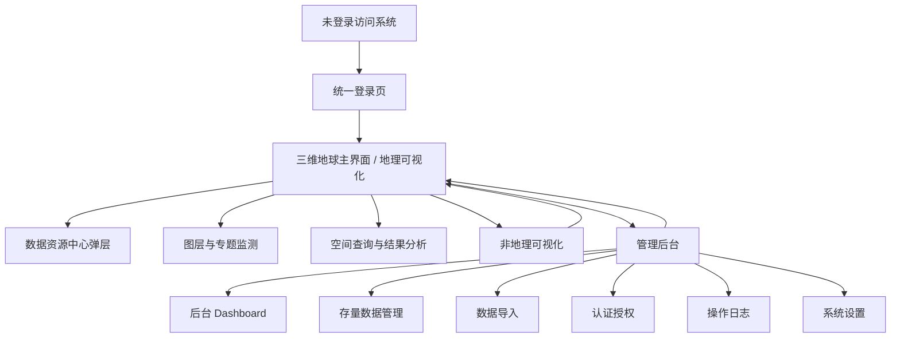

# 前端界面优化设计方案

本文档是“中亚胡杨林生态系统保护数据共享平台”的前端界面优化设计稿。当前阶段只做设计，不改动系统实现代码。设计目标是在保留现有业务逻辑、权限体系、三维地球工作台、数据管理和后台管理边界的基础上，把登录后的首屏从“地理可视化/非地理可视化/管理后台三卡片入口页”调整为“以三维地球为核心的软件主界面”，并将非地理可视化和管理后台入口收纳到主界面顶部导航。

配套高保真 HTML 原型见：[ui-redesign-mockups.html](./ui-redesign-mockups.html)。

## 1. 设计总目标

1. 登录成功后直接进入三维地球主界面，不再出现三卡片选择页。
2. 三维地球主界面成为平台的“业务驾驶舱”，承载地图浏览、数据检索、图层管理、专题监测、空间查询、结果分析和权限入口。
3. 非地理可视化和管理后台作为顶部导航中的二级主模块，按权限显示或禁用。
4. 界面视觉从当前的浅色卡片入口和半透明侧栏，升级为“深色沉浸地图 + 玻璃质感数据面板 + 高级生态可视化图表”的整体体验。
5. 所有新增展示设计必须服务真实业务数据，包括生态指标、图层状态、栅格渲染、资源目录、导入任务、用户权限和操作日志，避免纯装饰图形。

## 2. 页面逻辑递进关系

建议路由关系：

| 当前页面 | 优化后定位 | 入口逻辑 |
| --- | --- | --- |
| `/login` 登录页 | 统一身份入口 | 未登录用户访问任何受保护页面时进入 |
| `/` 当前三卡片入口页 | 移除或重定向 | 登录后直接跳转 `/map`，`/` 可重定向到 `/map` |
| `/map` 地理可视化 | 平台主界面 | 登录成功后的默认页面 |
| `/nongeo` 非地理可视化 | 顶部导航模块 | 从主界面顶部导航进入 |
| `/admin` 管理后台 | 顶部导航模块 | 具备后台权限时显示，未授权不显示或禁用 |

## 3. 整体视觉语言

整体风格采用“生态科研数据驾驶舱”方向，而不是普通后台系统或宣传页。

色彩建议：

| 用途 | 色彩 |
| --- | --- |
| 主背景 | 夜幕墨绿 `#061b18`、深海青黑 `#071821` |
| 主品牌 | 胡杨绿 `#20b486`、深林绿 `#0e5c4c` |
| 空间数据 | 河流青 `#49c7ff`、遥感蓝 `#2f80ed` |
| 重点指标 | 沙金 `#f2b84b` |
| 风险告警 | 胭红 `#e85d75` |
| 文本面板 | 冷白 `#f7fbf7`、雾灰 `#d6e4df` |

界面质感：

1. 地图主界面使用深色沉浸式底图，三维地球在视觉中心。
2. 左、右、下三个面板使用半透明玻璃材质，但内容区要有足够对比度，确保表格、图表和按钮清晰。
3. 后台管理仍使用 Ant Design Pro 风格，但通过更强的指标卡、趋势图、状态图和权限矩阵提升高级感。
4. 圆角保持克制，主要面板和卡片建议 8px，符合当前系统风格。
5. 图表色彩使用多色主题，不让整个界面落入单一绿色或单一蓝色。

## 4. 顶部全局导航设计

三维地球主界面顶部导航是新的软件“主门面”。建议分成四区：

1. 品牌区：平台名称、当前模块标识、运行状态。
2. 主导航区：`地理可视化`、`非地理可视化`、`成果目录`、`管理后台`。其中管理后台按权限显示。
3. 全局检索区：一个短输入框，可搜索数据资源、图层、监测站点、行政区、成果文档。
4. 用户区：角色标签、消息/任务状态、个人中心、退出。

交互建议：

1. 当前页面高亮，例如三维地球主界面高亮“地理可视化”。
2. “非地理可视化”点击进入 `/nongeo`。
3. “管理后台”只有具备权限时显示，点击进入 `/admin/dashboard`。
4. 后台页面顶部提供“返回三维地球”按钮，避免用户迷失在后台。

## 5. 登录界面设计

### 页面目标

登录页既要完成身份认证，又要建立系统的科研、生态和空间数据气质。它不再只是一个表单，而是平台第一印象。

### 布局

左侧为沉浸式背景视觉，展示中亚胡杨林、河流走廊、遥感网格和数据流线的合成视觉。右侧为登录表单区。

### 信息结构

左侧视觉区：

1. 系统中文名称。
2. 平台定位文案：多源生态数据、空间可视化、成果共享。
3. 三个轻量指标：数据资源数、监测站点数、覆盖区域数。
4. 小型“生态数据流”示意图，表现遥感、野外监测、矢量图层和成果文档汇入平台。

右侧表单区：

1. 账号输入。
2. 密码输入。
3. 记住登录状态。
4. 忘记密码。
5. 登录按钮。
6. 注册入口是否显示仍由后台配置决定。
7. 登录失败时在表单上方展示明确错误状态。

### 可视化图表

登录页不放复杂图表，只放简洁可信的微型数据视图：

1. 环形覆盖率图：展示平台资料覆盖度。
2. 迷你趋势线：展示最近数据更新趋势。
3. 数据来源图标组：遥感影像、野外样方、监测站、成果文档。

## 6. 三维地球主界面设计

### 页面目标

这是登录后的默认界面，也是平台最重要页面。用户打开系统后应立即看到三维地球、胡杨林重点区域、已加载图层概览和生态指标态势。

### 总体布局

页面保留当前形态：顶部导航、左侧栏、右侧栏、底部栏、中央三维地球。

布局建议：

| 区域 | 建议宽高 | 功能 |
| --- | --- | --- |
| 顶部导航 | 高 64px，左右留 16px | 模块切换、全局搜索、用户状态 |
| 左侧栏 | 宽 340px | 数据资源、图层树、专题目录 |
| 右侧栏 | 宽 360px | 生态态势、要素属性、监测详情 |
| 底部栏 | 高 230px | 空间查询、结果表格、时间轴、图例 |
| 中央区 | 自适应 | 三维地球、地图控件、专题叠加 |

### 中央三维地球

中央视觉必须更“高级”：

1. 三维地球使用深色大气层、经纬网、重点区域高亮和发光监测点。
2. 胡杨林分布区以暖绿色或沙金边界显示。
3. 河流廊道、水域、样地和遥感瓦片使用不同层级符号。
4. 鼠标悬停时显示轻量 tooltip，点击后右侧面板切换为要素详情。
5. 右下角放地图控件组：复位、放大、缩小、定位、底图、全屏。
6. 地图左下角可显示比例尺、坐标、当前视角高度。

### 左侧栏设计

左侧栏从“已加载图层”升级为“数据资产与图层控制中心”，建议使用顶部 Tabs：

1. `数据`
2. `图层`
3. `专题`

#### 数据 Tab

展示内容：

1. 搜索框：按数据名称、编号、来源检索。
2. 快速筛选：矢量、栅格、表格、文档、图片、基因。
3. 数据资源列表：每项显示名称、类型、时间、来源、是否可渲染。
4. 数据资产概览：小型环形图展示各类型资源占比。
5. 数据更新时间：迷你柱状图展示近 7 日入库数量。
6. 当前选中资源的元数据摘要。

图表建议：

| 图表 | 数据 |
| --- | --- |
| 环形图 | 数据类型占比：矢量、栅格、表格、文档、图片 |
| 横向条形图 | 专题分类资源数：胡杨分布、水文、土壤、气候、样方 |
| 迷你柱状图 | 最近 7 日导入或更新数量 |

#### 图层 Tab

展示内容：

1. 已加载图层树。
2. 图层组开关、可见性、透明度滑块。
3. 图层顺序拖拽。
4. 定位、属性表、符号化、导出、移除图标按钮。
5. 图例缩略区：点、线、面、栅格色带。
6. 图层性能状态：瓦片加载、渲染耗时、可见要素数。

图表建议：

| 图表 | 数据 |
| --- | --- |
| 进度条 | 栅格瓦片加载进度 |
| 色带图例 | NDVI、水分、盐渍化、土地覆盖分类 |
| 状态圆点 | 图层可见、加载中、失败、权限受限 |

#### 专题 Tab

展示内容：

1. 专题场景卡片：胡杨林分布、水文生态、遥感影像、野外监测、保护成果。
2. 每个专题显示已加载图层数、推荐图层、更新时间。
3. 一键加载专题组合。
4. 专题说明与指标解释。

图表建议：

1. 专题覆盖雷达图：空间、时间、来源、质量、更新度。
2. 专题数据完整度条。

### 右侧栏设计

右侧栏从单纯“要素属性”升级为“态势洞察面板”，使用 Tabs：

1. `概览`
2. `要素`
3. `监测`

#### 概览 Tab

无要素选中时默认展示整体态势：

1. 生态健康指数卡片。
2. NDVI 均值趋势。
3. 水分指数、土壤盐渍化、地下水埋深等关键指标。
4. 监测站在线状态。
5. 风险事件时间线。

图表建议：

| 图表 | 数据 |
| --- | --- |
| 仪表盘 | 生态健康指数 |
| 折线图 | NDVI、EVI、地表温度趋势 |
| 堆叠条 | 不同风险等级面积 |
| 状态矩阵 | 监测站在线、离线、异常 |
| 时间线 | 最近导入、预警、导出、权限变更 |

#### 要素 Tab

选中地图要素后展示：

1. 要素名称、类型、所属图层。
2. 主要属性字段。
3. 关联资源和元数据。
4. 该要素的时间序列趋势。
5. 周边缓冲区统计。

图表建议：

1. 属性值对比条形图。
2. 小型折线图展示该点或区域近年 NDVI。
3. 周边 5km 指标雷达图。

#### 监测 Tab

展示监测站、样方、遥感任务和栅格处理任务：

1. 监测站列表和在线状态。
2. 样方调查完成率。
3. 栅格任务队列。
4. 异常指标提醒。

图表建议：

1. 站点状态棋盘图。
2. 任务进度条。
3. 异常指标红黄绿分布。

### 底部栏设计

底部栏用于承载“操作结果”和“分析控制”，建议使用 Tabs：

1. `空间查询`
2. `结果`
3. `时间`
4. `图例`

#### 空间查询 Tab

内容：

1. 绘制工具：无、矩形、圆、椭圆、多边形。
2. 空间范围导入/导出。
3. 当前范围面积、周长、中心点。
4. 范围内资源命中统计。

图表建议：

1. 查询命中数量柱状图。
2. 空间范围指标卡。

#### 结果 Tab

内容：

1. 查询结果表格。
2. 字段筛选。
3. 地图高亮联动。
4. 导出按钮。

图表建议：

1. 字段分布直方图。
2. 分类占比条形图。
3. 结果质量提示。

#### 时间 Tab

内容：

1. 时间轴滑块。
2. 多年份对比。
3. 影像批次和监测批次切换。

图表建议：

1. 时间轴事件带。
2. 多年份指标折线对比。

#### 图例 Tab

内容：

1. 当前可见图层图例。
2. 栅格色带。
3. 矢量符号说明。
4. 透明度和分类样式入口。

## 7. 数据资源中心弹层设计

数据资源中心由主界面顶部“数据资源”按钮或左侧数据 Tab 触发。它不跳转页面，而是在地图上方打开宽抽屉或弹层。

布局：

1. 左侧筛选列：关键词、类型、专题、来源、时间、权限。
2. 中间资源列表：列表或表格视图切换。
3. 右侧资源详情：字段、空间范围、预览、加载按钮。
4. 顶部资产图表：类型占比、专题分布、最近更新。

图表建议：

1. 数据资产环形图。
2. 专题资源堆叠条。
3. 更新热力日历。
4. 栅格波段统计迷你图。

## 8. 非地理可视化界面设计

### 页面目标

非地理可视化用于承载表格数据、基因数据、文档成果、图片资料等非空间或弱空间数据。它应从空页面升级为“科研数据分析工作台”。

### 布局

1. 顶部沿用全局导航，当前高亮“非地理可视化”。
2. 左侧为数据集导航和筛选。
3. 中间为图表工作区。
4. 右侧为变量、字段、样本组和图表配置。
5. 底部为数据表或样本列表。

### 功能界面

1. 数据总览：按数据类型、来源、年份、主题查看。
2. 表格分析：字段分布、分组统计、相关性分析。
3. 基因可视化：热力图、聚类树、样本关系网络。
4. 成果文档：成果数量、发布年份、关键词云、下载排行。
5. 图片资料：样方照片、遥感解译图、现场记录图册。

### 可视化图表

| 场景 | 图表 |
| --- | --- |
| 基因数据 | 热力图、聚类树、样本网络图 |
| 表格监测 | 折线图、散点图、箱线图、相关性矩阵 |
| 成果文档 | 年份柱状图、关键词云、下载排行 |
| 综合总览 | KPI 卡片、数据类型环形图、来源桑基图 |

## 9. 管理后台界面设计

后台仍以 Ant Design Pro 的管理效率为优先，不建议做成纯大屏。但每个后台页面应增加更明确的数据可视化，帮助管理员快速判断状态。

### 后台 Dashboard

布局：

1. 顶部 KPI：数据资源、图层数、栅格任务、用户数、活跃用户、系统告警。
2. 中部：数据增长趋势、资源类型占比、活跃用户趋势。
3. 右侧：服务器 CPU、内存、磁盘仪表盘。
4. 底部：最近导入任务、最近操作日志、异常提示。

图表建议：

1. 指标卡。
2. 堆叠柱状图。
3. 折线图。
4. 半环仪表盘。
5. 操作时间线。

### 存量数据管理

布局：

1. 顶部筛选表单。
2. 统计卡片：当前结果、启用、禁用、受限访问、未配置可视化。
3. 主表格：数据资源、类型、状态、来源、日期、访问范围、可视化方案、更新时间。
4. 右侧抽屉：默认图层、符号化、权限、元数据预览。

图表建议：

1. 类型占比环形图。
2. 权限分布条形图。
3. 可视化配置完成率进度条。

### 数据导入

布局：

1. 步骤条：选择文件、导入配置、校验预览、提交入库。
2. 文件区：拖拽上传和文件信息。
3. 配置区：数据类型、专题、来源、坐标字段、时间字段。
4. 校验区：结构、字段、空间范围、权限、重复数据。
5. 预览区：字段表格和错误列表。

图表建议：

1. 校验通过率仪表。
2. 字段类型分布条形图。
3. 空间范围缩略图。
4. 错误类型排行。

### 认证授权

布局：

1. 左侧用户与用户组列表。
2. 中部权限矩阵。
3. 右侧权限说明和影响范围。
4. 顶部统计：用户总数、管理员数、活跃账号、无权限账号。

图表建议：

1. 权限覆盖矩阵。
2. 角色人数柱状图。
3. 权限模块雷达图。

### 操作日志

布局：

1. 顶部筛选：用户、模块、操作、时间、结果。
2. 中部日志表。
3. 右侧风险摘要。
4. 下方时间线。

图表建议：

1. 操作量时间趋势。
2. 操作模块占比。
3. 异常操作排行。

### 系统设置

布局：

1. 基础配置。
2. TOML 路径配置。
3. 缓存策略。
4. 栅格脚本接口。
5. 配置健康检查。

图表建议：

1. 配置健康状态卡。
2. 缓存使用进度条。
3. 脚本执行成功率趋势。

## 10. 关键交互状态

1. 空状态：不再只显示空盒子，应给出“可执行下一步”，例如“从数据资源中心加载图层”。
2. 加载状态：地图图层加载时在图层树显示进度，在地图中央显示轻量加载提示。
3. 失败状态：失败图层保留在树中，显示错误图标和重试入口。
4. 权限状态：无权限入口不出现；必要时禁用并提示当前用户组无权限。
5. 选中状态：地图要素、结果表行、图层树节点必须互相联动高亮。
6. 面板折叠：左、右、下三个面板都应可折叠，给地图留出沉浸浏览空间。

## 11. 后续落地建议

如果进入实现阶段，建议按以下顺序推进：

1. 路由调整：登录后默认进入 `/map`，`/` 重定向 `/map`，移除“返回入口”主路径。
2. 顶部导航改造：在 MapPage 顶部加入地理可视化、非地理可视化、管理后台入口。
3. 三维地球主界面视觉升级：先改 CSS 和面板布局，不改 API。
4. 左侧栏重构：把数据、图层、专题合为 Tabs。
5. 右侧栏扩展：默认概览态势，选中要素后切换详情。
6. 底部栏扩展：空间查询、结果、时间、图例四类。
7. 非地理可视化补全：先做静态数据总览，再接入真实数据。
8. 后台图表增强：在现有 Ant Design Pro 页面上逐步增加统计图表。

本设计阶段不涉及 OpenAPI、后端权限、数据库和栅格渲染接口变更。

## 12. 三维地球主界面深化设计

本轮深化设计把三维地球主界面拆成“地图主视图 + 左侧业务控制 + 底部查询分析 + 右侧定位与生态洞察”的工作台结构。核心原则是：左侧负责“选什么数据和图层”，中央负责“看空间位置和空间关系”，底部负责“怎么查、查到了什么、随时间如何变化”，右侧负责“当前视角在哪里、生态状态如何、选中对象是什么”。

### 12.1 主界面模块逻辑

三维地球主界面的信息流建议如下：

1. 用户先通过顶部导航确认当前模块，并可进入非地理可视化或管理后台。
2. 用户在左侧 `数据` Tab 中检索资源，并将资源加载到图层。
3. 已加载资源进入左侧 `图层` Tab，用户调整显隐、透明度、顺序、符号化和导出。
4. 常用组合进入左侧 `专题` Tab，用户一键加载胡杨分布、水文生态、遥感影像、野外监测等专题场景。
5. 用户在中央三维地球中浏览、缩放、旋转、选择范围或点击要素。
6. 底部 `空间查询` Tab 管理绘制范围；`结果` Tab 展示命中列表和统计；`时间` Tab 控制多年份、多批次对比；`图例` Tab 解释当前可见符号。
7. 右侧上栏始终显示当前视角平面缩略图，帮助用户理解当前地球视角所在区域。
8. 右侧下栏根据状态展示 `概览`、`要素`、`监测`，分别用于生态态势、选中对象详情和监测任务状态。

### 12.2 左侧栏深化

左侧栏建议固定宽度约 360px，采用 Tabs：`数据`、`图层`、`专题`。

#### 数据 Tab

功能定位：负责“从平台资源库中找到并加载数据”。

内容分区：

1. 顶部检索：关键词、类型、专题、来源、时间范围。
2. 数据资产总览：展示资源总数、可渲染数量、元数据完整度、今日更新。
3. 类型占比：环形图展示矢量、栅格、表格、成果、图片占比。
4. 专题分布：横向条形图展示胡杨分布、水文、土壤、气候、样方资源数量。
5. 更新节奏：近 7 日柱状图展示资源入库和更新情况。
6. 推荐资源列表：每条展示名称、类型、年份、来源、加载状态和操作按钮。

建议图表：

| 位置 | 图表 | 数据含义 |
| --- | --- | --- |
| 资产总览 | KPI 卡片 | 资源总数、可加载数、字段完整度、今日更新 |
| 类型分布 | 环形图 | 数据类型占比 |
| 专题分布 | 横向条形图 | 各专题资源数量 |
| 更新节奏 | 迷你柱状图 | 近 7 日入库/更新趋势 |

#### 图层 Tab

功能定位：负责“管理已经加载到地球上的图层”。

内容分区：

1. 已加载图层组树：按专题或数据来源分组。
2. 图层状态：可见、隐藏、加载中、失败、权限受限。
3. 图层操作：定位、属性表、符号化、导出、移除。
4. 透明度和层级顺序：滑块和拖拽排序。
5. 栅格渲染状态：瓦片进度、样式哈希、渲染耗时。
6. 当前图例预览：点、线、面、栅格色带。

建议图表：

| 位置 | 图表 | 数据含义 |
| --- | --- | --- |
| 图层组卡片 | 进度条 | 图层加载进度和透明度 |
| 栅格状态 | 小型任务条 | 瓦片请求、渲染、缓存状态 |
| 图例预览 | 色带和符号矩阵 | 当前图层的视觉规则 |
| 性能摘要 | 指标卡 | 可见图层数、要素数、瓦片耗时 |

#### 专题 Tab

功能定位：负责“按业务主题快速组织地图场景”。

内容分区：

1. 专题场景卡片：胡杨分布、水文生态、遥感影像、野外监测、保护成果。
2. 场景完整度：展示空间覆盖、时间连续性、数据质量、更新频率、权限覆盖。
3. 一键加载：加载该专题推荐图层组。
4. 专题指标：展示专题下关键指标，例如 NDVI、地下水埋深、盐渍化风险、样方完成率。
5. 专题说明：解释该专题适用场景和数据来源。

建议图表：

| 位置 | 图表 | 数据含义 |
| --- | --- | --- |
| 专题卡片 | 雷达图 | 空间、时间、质量、来源、更新度 |
| 指标摘要 | 多色 KPI | 专题核心指标 |
| 场景覆盖 | 堆叠条 | 已覆盖、待补充、权限受限 |

### 12.3 底部栏深化

底部栏建议高约 240px，保持不遮挡主地球视觉中心。底部栏不再只放绘制按钮，而是承担空间查询完整闭环。

#### 空间查询 Tab

内容：

1. 绘制方式：无、矩形、圆、椭圆、多边形。
2. 范围操作：清除、导入 GeoJSON、导出 GeoJSON、保存为常用范围。
3. 范围指标：面积、周长、中心点、覆盖行政区或流域。
4. 命中预估：按数据类型展示当前范围可能命中的资源数量。

图表：范围 KPI、命中预估柱状图、范围坐标摘要。

#### 结果 Tab

内容：

1. 查询结果表格：字段可排序、可筛选、可联动地图高亮。
2. 结果统计：命中总数、返回数、选中数、可导出数。
3. 字段分布：按保护等级、数据类型、流域、年份分布。
4. 操作按钮：加载为图层、导出、加入成果、清空结果。

图表：分类条形图、字段直方图、结果质量提示。

#### 时间 Tab

内容：

1. 时间轴滑块：按年、月、批次切换。
2. 多年份对比：显示当前指标在不同年份的走势。
3. 事件带：标注遥感影像批次、样方调查、导入任务、风险预警。
4. 播放控制：播放、暂停、前后步进。

图表：时间轴事件带、多线趋势图、年份节点状态。

#### 图例 Tab

内容：

1. 当前可见图层图例。
2. 矢量符号：点、线、面样式。
3. 栅格色带：NDVI、水分、盐渍化、土地覆盖。
4. 分类阈值说明：低、中、高或风险等级。
5. 透明度快速调节。

图表：色带、分类矩阵、符号说明表。图例应包含边框范围符号，避免只显示色块而无法理解空间边界。

### 12.4 右侧栏深化

右侧栏由一个长栏改成两个独立上下对齐侧栏。

上侧短栏：当前视角平面缩略图。

1. 高度建议 150-180px。
2. 不使用 Tab，始终固定显示。
3. 展示当前地球视角对应的二维范围框、中心点、经纬度、缩放层级、所处流域或行政区。
4. 支持点击“回到全域”或“锁定当前范围”。

下侧生态信息栏：使用 Tabs `概览`、`要素`、`监测`。

#### 概览 Tab

展示全局或当前范围生态态势：

1. 综合生态健康指数仪表。
2. NDVI、水分指数、风险面积、站点在线率 KPI。
3. NDVI 与水分指数趋势折线。
4. 风险等级面积堆叠条。
5. 监测站在线状态矩阵。

#### 要素 Tab

地图点击要素后展示：

1. 要素标题、所属图层、类型、更新时间。
2. 属性字段摘要。
3. 要素近年 NDVI/水分/风险趋势。
4. 周边缓冲区统计。
5. 关联数据和成果文档。

#### 监测 Tab

展示监测站和任务状态：

1. 站点在线矩阵。
2. 监测任务进度。
3. 栅格渲染任务队列。
4. 异常指标排行。
5. 最新监测记录时间线。

## 13. 数据资源中心与非地理可视化补充

### 13.1 数据资源中心

数据资源中心应作为主界面的宽弹层，保留地图上下文。建议在原有三列布局基础上增加：

1. 顶部资源态势带：资源总量、可渲染、可查询、权限受限、今日更新。
2. 左侧筛选与资源画像：类型、专题、来源、时间、权限筛选，并显示类型占比和更新时间热力图。
3. 中间资源列表：支持列表/卡片/表格视图切换。
4. 右侧预览：字段、空间范围、栅格波段、默认符号化、加载前影响提示。
5. 底部最近使用：最近加载、最近查询、最近导出。

### 13.2 非地理可视化

非地理页面应明确分成四类工作区：

1. 数据总览：非空间数据类型、来源、年份、质量状态。
2. 表格分析：字段分布、散点、折线、箱线、相关性矩阵。
3. 基因分析：热力图、聚类树、样本网络、分群对比。
4. 成果分析：年份柱状、关键词云、下载排行、成果类型占比。

右侧配置面板需要提供字段映射、分组变量、聚合方式、筛选条件、图表主题等配置，底部保留数据表预览和导出入口。

## 14. 管理后台页面重整

用户说“六个界面”，但当前菜单实际包含 Dashboard、用户设置、操作日志、系统设置、存量数据、数据导入、用户管理、用户组权限，共 8 个页面。设计上按 8 个页面整理，仍沿用 Ant Design Pro 的左侧菜单与内容区。

| 页面 | 设计重点 | 推荐图表 |
| --- | --- | --- |
| Dashboard | 平台运行总览 | KPI、资源趋势、活跃用户、服务器仪表、最近操作时间线 |
| 用户设置 | 个人资料与权限可见性 | 权限雷达图、登录趋势、安全状态卡 |
| 操作日志 | 审计与异常定位 | 操作趋势、模块占比、异常排行、日志时间线 |
| 系统设置 | TOML、缓存、脚本、路径健康 | 配置健康卡、缓存进度、脚本成功率、路径状态列表 |
| 存量数据 | 数据清单、权限、默认可视化 | 类型占比、配置完成率、权限分布、数据表 |
| 数据导入 | 文件接入、配置、校验、入库 | 步骤条、校验通过率、字段类型分布、错误排行 |
| 用户管理 | 用户列表、状态、角色分配 | 用户状态环形图、角色人数柱状、活跃趋势 |
| 用户组权限 | 角色与功能权限矩阵 | 权限矩阵、模块覆盖率、风险权限提示 |

后台不建议做成全屏大屏，而是保持可操作性：表格、表单、抽屉、弹窗仍使用 Ant Design 标准组件；图表用于辅助判断状态，不替代表格操作。
